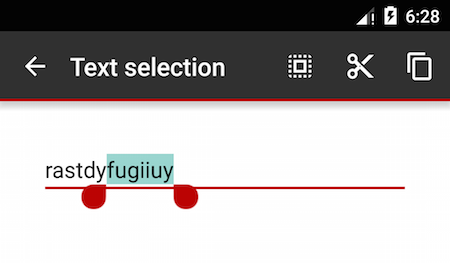
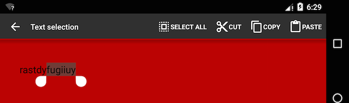
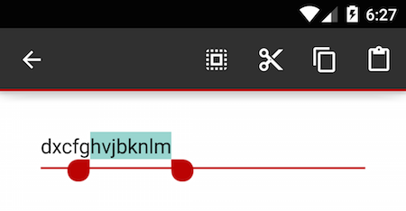
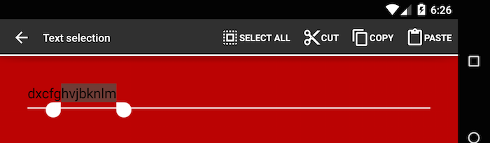

EditText tinting issue demo
===========================

This demo app showcases an issue with `EditText` background tinting on API 22. The issue is *not* reproduced on API
levels below 22.

The issue is the following: we define a `controlColorNormal` and `controlColorActivated` attribute in the theme, and
change it in the `land` configuration to something else. On Android up to version 5.0.x, the new `controlColor*` are
correctly applied for both `port` and `land` orientations. On Android 5.1, the "other" variant of the color is not
applied to the `EditText` background (and only to that, every other thing is correctly tinted, including the other
`EditText` tintable items (the input cursor, the selection handles, etc).

It looks like Android 5.1 sticks to whatever `controlColor*` is applied at app startup, and does not update the theme on
configuration changes. If you start the app with the device in landscape, it pick up the correct `land` version of the
colour, but retain it on `port` as well.

### Bugged behaviour (API 22)

### Expected behaviour (API 21 and lower)

